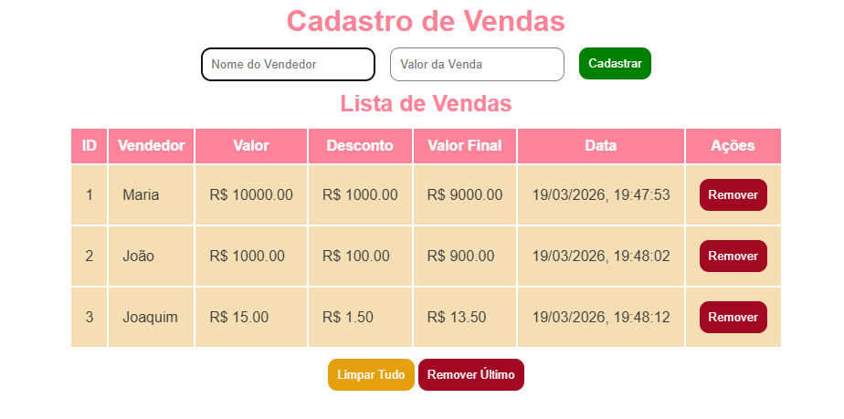

# Cadastro de Vendas JS
Um sistema dinâmico de gerenciamento de vendas desenvolvido com JavaScript Vanilla, HTML5 e CSS3. O projeto permite o registro de vendedores, cálculo automático de descontos e manipulação em tempo real do DOM.

##Funcionalidades

- **Registro de Vendas:** Captura nome do vendedor e valor bruto.
- **Cálculo Automático:** Aplica 10% de desconto sobre o valor da venda instantaneamente.
- **ID Sequencial:** Gera identificadores únicos para cada registro.
- **Data e Hora Real:** Registra o momento exato do cadastro (DD/MM/AAAA, HH:MM:SS).

---

## 📁 Estrutura do Projeto

<pre>
├── index.html 
├── style.css 
├── script.js
└── README.md
</pre>

---

## Como Rodar o Projeto
- Clone este repositório:

```bash
git clone https://github.com/codedbydaph/cadastro_vendas.git
```
- Navegue até a pasta do projeto.
- Abra o arquivo index.html em qualquer navegador.

## Interface

<p align="center">
  
</p>
